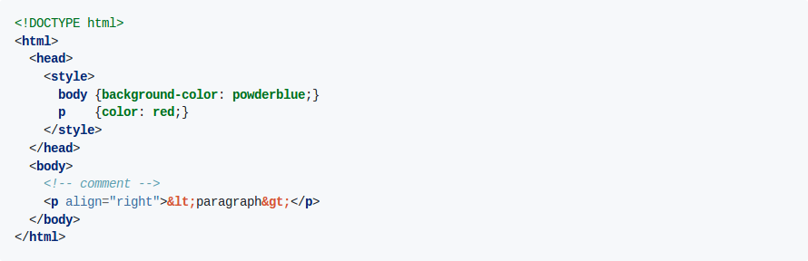

Highlighter
===========

[](https://www.travis-ci.org/edadma/highlighter)
[](https://ci.appveyor.com/project/edadma/highlighter)
[](https://coveralls.io/github/edadma/highlighter?branch=master)
[](https://github.com/edadma/highlighter/blob/master/LICENSE)
[](https://github.com/edadma/highlighter/releases/tag/v0.1.1)

*Highlighter* is a regular expression based syntax highlighter library written in [Scala](http://scala-lang.org). Highlighter is inspired by [Pygments](http://pygments.org/), and it is not difficult to port Pygments lexers to Highlighter.  Highlighter has a convenient definition language to make it easier to develop new highlighters.

Examples
--------

### Highlighter Definition

Here's an example of a typical Highlighter definition and the result of applying it to a small HTML document.  This definition is a port of the [Pygments HTML Lexer](https://bitbucket.org/birkenfeld/pygments-main/src/default/pygments/lexers/html.py) which includes CSS highlighting for `style` elements.

#### Definition

```
highlighter
  name: HTML
options
  regex: dotall ignorecase
templates
  default: {{ <span class="\class">\escape\text</span> }}
states
  root:
    &\S*?;                        => Name.Entity
    \<\!\[CDATA\[.*?\]\]\>        => Comment.Preproc
    <!--                          => Comment >comment
    <\?.*?\?>                     => Comment.Preproc
    <![^>]*>                      => Comment.Preproc
    (<)\s*(script)\s*             => (Punctuation Name.Tag) >script-content >tag
    (<)\s*(style)\s*              => (Punctuation Name.Tag) >style-content >tag
    (<)\s*([\w:.-]+)              => (Punctuation Name.Tag) >tag
    (<)\s*(/)\s*([\w:.-]+)\s*(>)  => (Punctuation Punctuation Name.Tag Punctuation)
  comment:
    [^-]+  => Comment
    -->    => Comment ^
    -      => Comment
  tag:
    ([\w:-]+)\s*(=)\s*  => (Name.Attribute Operator) >attr
    [\w:-]+             => Name.Attribute
    (/?)\s*(>)          => (Punctuation Punctuation) ^
  script-content:
    (<)\s*(/)\s*(script)\s*(>)  => (Punctuation Punctuation Name.Tag Punctuation) ^
    .+?(?=<\s*/\s*script\s*>)   => [javascript]
  style-content:
    (<)\s*(/)\s*(style)\s*(>)  => (Punctuation Punctuation Name.Tag Punctuation) ^
    .+?(?=<\s*/\s*style\s*>)   => [css]
  attr:
    ".*?"    => String ^
    '.*?'    => String ^
    [^\s>]+  => String ^
```

#### Input

```
<!DOCTYPE html>
<html>
  <head>
    <style>
      body {background-color: powderblue;}
      p    {color: red;}
    </style>
  </head>
  <body>
    <!-- comment -->
    <p align="right">&lt;paragraph&gt;</p>
  </body>
</html>
```

#### Output

The styling that was used for the highlighting was Pygments "friendly" theme.




Usage
-----

### Library

Use the following definition to use Highlighter in your Maven project:

```xml
<repository>
  <id>hyperreal</id>
  <url>https://dl.bintray.com/edadma/maven</url>
</repository>

<dependency>
  <groupId>xyz.hyperreal</groupId>
  <artifactId>highlighter</artifactId>
  <version>0.1.1</version>
</dependency>
```

Add the following to your `build.sbt` file to use Highlighter in your SBT project:

```sbt
resolvers += "Hyperreal Repository" at "https://dl.bintray.com/edadma/maven"

libraryDependencies += "xyz.hyperreal" %% "highlighter" % "0.1.1"
```

### Executable

An executable can be downloaded from [here](https://dl.bintray.com/edadma/generic/highlighter-0.1.1.jar). *You do not need* the Scala library for it to work because the JAR already contains all dependencies. You just need Java 8+ installed.

Run it as a normal Java executable JAR with the command `java -jar highlighter-0.1.1.jar <definition>... [<input>]` in the folder where you downloaded the file, where *definition* is the name of the highlighter definition file, and <input> is the file containing the code to be highlighted.  If multiple definition files are given, the first one is used for highlighting and the others are passed to it as dependencies.

Building
--------

### Requirements

- Java 8
- SBT 1.1.5+
- Scala 2.12.6+

### Clone and Assemble Executable

```bash
git clone git://github.com/edadma/highlighter.git
cd highlighter
sbt assembly
```

The command `sbt assembly` also runs all the unit tests.


License
-------

ISC © 2018 Edward A. Maxedon, Sr.